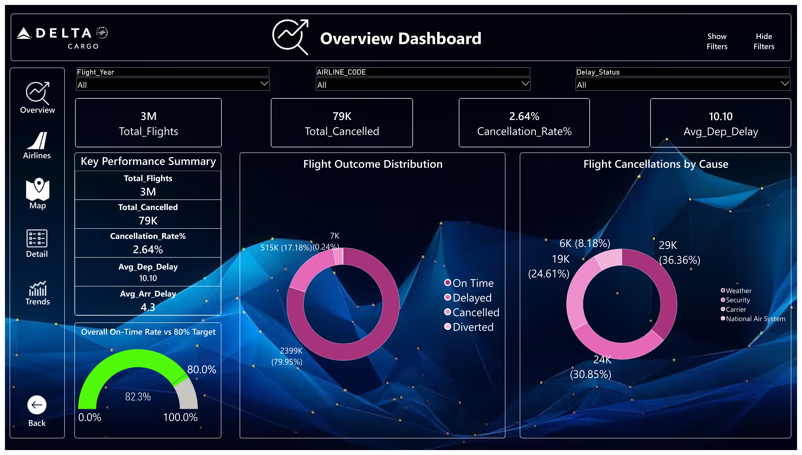
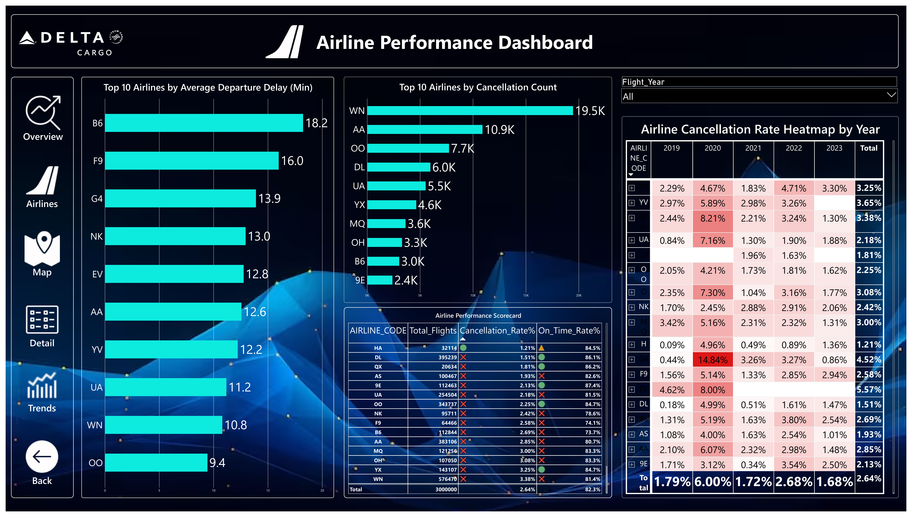
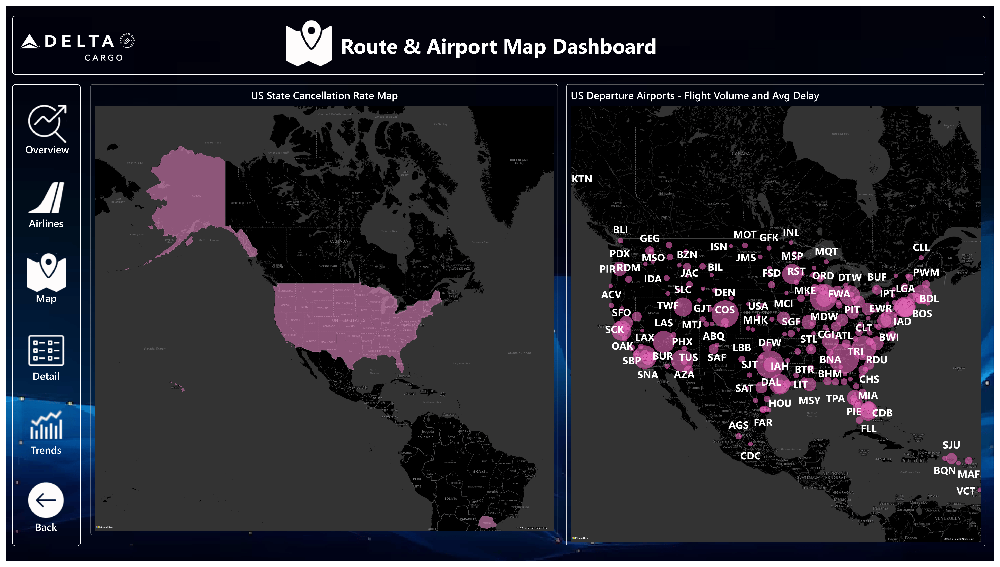
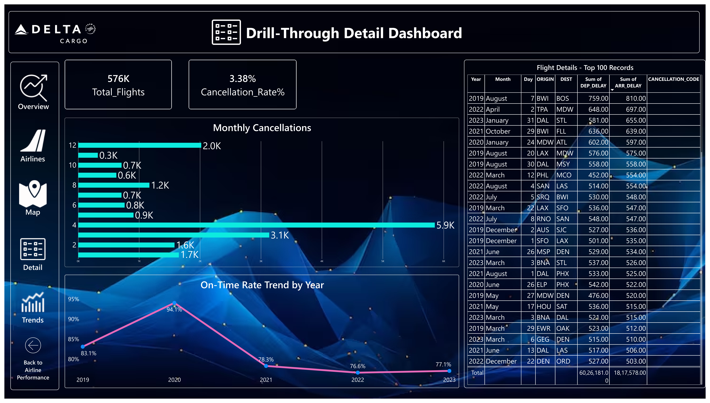
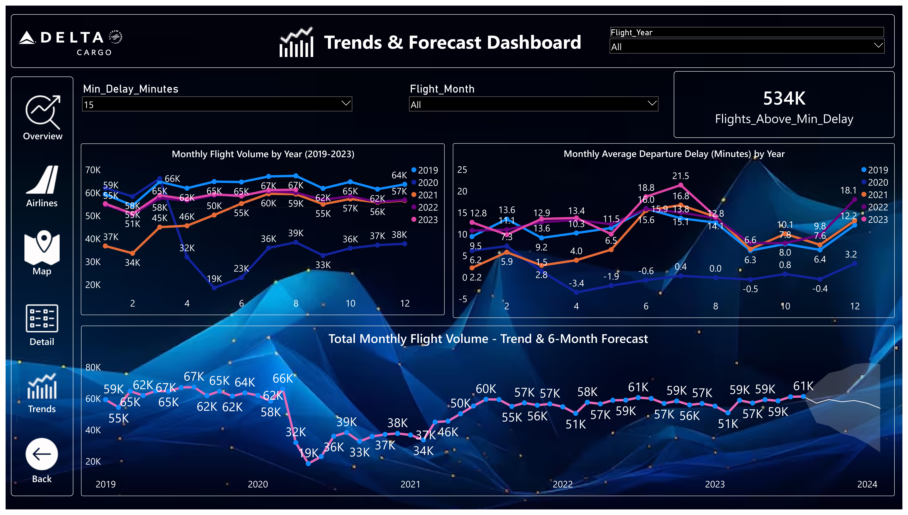
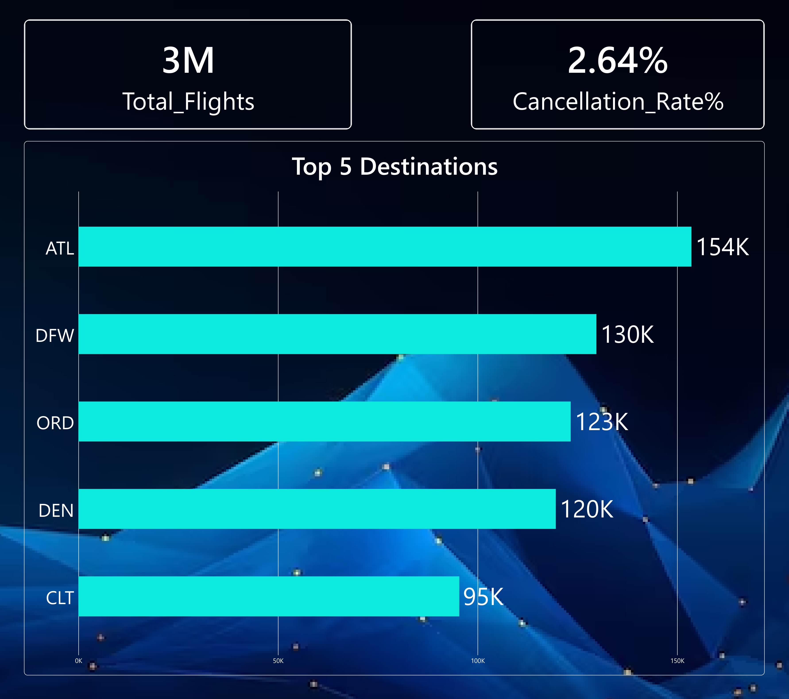

# ✈️ Flight Delays 2019–2023 Analytics Dashboard

> **Interactive Power BI dashboard for flight performance, cancellations, airline, airport, geographic, trend, and forecasting analytics.**

[](https://powerbi.microsoft.com/)
[]()
[]()

---

## 🖥️ Dashboard Preview

### Overview


### Airline Performance


### Route & Airport Map


### Drill-Through Detail


### Trends & Forecast


### Tooltip Airport


---

## 📌 Project Overview

The **Flight Delays 2019–2023 Analytics Dashboard** is an interactive Power BI solution designed to transform flight data into actionable aviation insights.

The report provides a consolidated view of:

- Overall flight performance
- Flight cancellations and cancellation rates
- Airline-level performance
- Departure delays
- Cancellation reasons
- Airport activity
- US-state cancellation rates
- Monthly and yearly flight trends
- Six-month flight-volume forecasting
- Airline-level drill-through analysis
- Detailed flight records

The dashboard is designed with interactive navigation, slicers, KPI cards, charts, maps, tooltips, drill-through analysis, and forecasting features.

---

## 📑 Dashboard Pages

| Page | Purpose |
|---|---|
| **Overview** | High-level KPIs, flight outcomes, airline comparisons, cancellation reasons, and interactive filters |
| **Airline Performance** | Airline cancellation counts, average departure delays, and year-by-year cancellation-rate comparison |
| **Route & Airport Map** | Geographic analysis of departure airports and US-state cancellation rates |
| **Trends & Forecast** | Monthly/yearly flight-volume trends, departure-delay trends, and a 6-month flight-volume forecast |
| **Drill-Through Detail** | Airline-specific KPIs, cancellation trends, cancellation reasons, and detailed flight records |
| **Tooltip Airport** | Contextual airport-level information through Power BI tooltips |
| **Navigation** | Dedicated navigation interface for moving between report sections |

---

## 🎯 Key KPIs

The report includes measures such as:

- **Total Flights**
- **Total Cancelled**
- **Cancellation Rate**
- **On-Time Rate**
- **Average Departure Delay**
- **Flights Above Minimum Delay**
- **Flight Outcome Distribution**

These KPIs respond dynamically to report filters and slicers.

---

## 📊 Visual Analytics

### Flight Performance

The Overview page combines KPI cards and visuals to provide a quick snapshot of flight activity.

**Included analysis:**

- Total flight volume
- Total cancelled flights
- Cancellation rate
- On-time rate
- Flight outcome distribution
- Airline flight-volume comparison
- Cancellation reason breakdown
- On-time performance against an **80% target**

### Airline Performance

The Airline Performance page focuses on comparing airline reliability and delays.

**Included analysis:**

- Top 10 airlines by cancellation count
- Top 10 airlines by average departure delay
- Airline cancellation-rate heatmap by year
- Flight-year filtering

### Trends & Forecast

The Trends & Forecast page focuses on historical patterns and future flight-volume estimates.

**Included analysis:**

- Monthly flight-volume trend
- **6-month flight-volume forecast**
- Monthly average departure delay by year
- Monthly flight-volume comparison across 2019–2023
- Minimum-delay filtering
- Flights above the selected minimum-delay threshold

### Geographic Analysis

The Route & Airport Map page provides geographic exploration of flight activity.

**Included analysis:**

- US departure-airport activity map
- Total flights by origin airport
- US-state cancellation-rate map

### Drill-Through Analysis

Selecting an airline can open a detailed airline-level analysis containing:

- Airline-specific KPIs
- On-time-rate trend by year
- Monthly cancellation analysis
- Cancellation reason breakdown
- Detailed flight records
- Origin and destination information
- Departure and arrival delay values

---

## 🧠 DAX & Data Modeling

The dashboard uses a Power BI semantic model with dedicated analytical measures.

### Core Measures

```text
Total_Flights
Total_Cancelled
Cancellation_Rate%
On_Time_Rate%
Avg_Dep_Delay
Flights_Above_Min_Delay
```

A dedicated `MEASURES_` table is used to organize the report's analytical calculations.

The report also uses a metric-selector structure for interactive metric analysis.

---

## 🎛️ Interactivity

The report includes:

- Year slicers
- Airline filters
- Flight-status filters
- Month filters
- Minimum-delay filtering
- Interactive cross-filtering
- Drill-through pages
- Report tooltips
- Navigation buttons
- Dynamic metric selection
- Geographic maps
- Forecasting

This allows users to move from a high-level overview to detailed airline, airport, and flight-level analysis.

---

## 🛠️ Tools & Technologies

| Technology | Usage |
|---|---|
| **Microsoft Power BI** | Dashboard development & visualization |
| **DAX** | Measures and analytical calculations |
| **Power Query** | Data transformation and preparation |
| **Data Modeling** | Relationships and semantic model design |
| **Power BI Maps** | Geographic analysis |
| **Power BI Forecasting** | Short-term flight-volume forecasting |
| **Interactive UX** | Slicers, navigation, filters and drill-through |

---

## 📂 Repository Structure

```text
Flight-Delays-Analytics/
│
├── 📊 PR__5.pbix
├── 📄 README.md
│
└── Images/
    ├── Overview.png
    ├── Airline Performance.png
    ├── Drill-Through Detail.png
    ├── Route & Airport Map.png
    ├── Tooltip Page.png
    └── Trends & Forecast.png
```

---

## 🚀 How to Use

1. Download or clone this repository.
2. Open `PR_5.pbix` using **Microsoft Power BI Desktop**.
3. Refresh the data if the underlying source is available.
4. Start from the **Overview** page.
5. Use slicers and filters to explore the flight data.
6. Navigate between dashboard pages.
7. Select an airline where applicable to explore the drill-through analysis.
8. Hover over map and visual elements to access tooltip information.

---

## 💡 Business Questions Answered

This dashboard can help answer questions such as:

- How many flights were operated?
- What percentage of flights were cancelled?
- What is the on-time rate?
- Which airlines have the highest cancellation counts?
- Which airlines have higher average departure delays?
- What are the major cancellation reasons?
- How does flight volume change over time?
- How does departure delay change by month and year?
- Which airports have significant flight activity?
- Which US states have higher cancellation rates?
- What does the six-month flight-volume forecast indicate?
- How does an individual airline perform across different years and months?

---

## 📈 Project Highlights

- ✅ Portfolio-ready aviation analytics dashboard
- ✅ Multi-page Power BI report
- ✅ KPI-driven executive overview
- ✅ Interactive filtering and navigation
- ✅ Airline performance analysis
- ✅ Cancellation and delay analysis
- ✅ Geographic airport and state analysis
- ✅ Time-based flight analysis
- ✅ Six-month forecasting
- ✅ DAX-based analytical measures
- ✅ Drill-through airline analysis
- ✅ Professional dashboard-focused UI

---
## 👤 Author

**Darshan Patil**

Power BI • Data Analytics • Business Intelligence

---

## ⭐ If You Find This Project Useful

If you like this dashboard or find it useful for learning Power BI and data analytics, consider giving the repository a ⭐.

---
